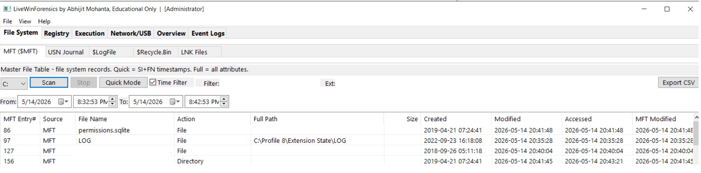
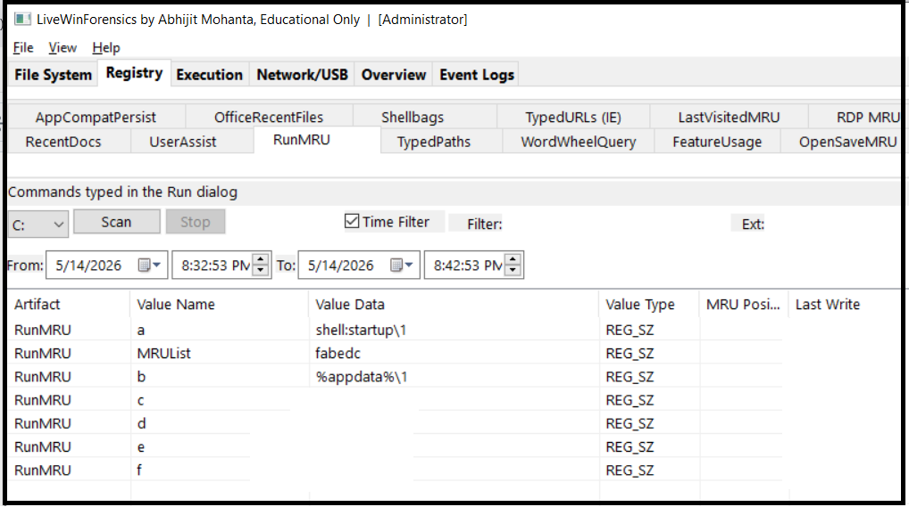
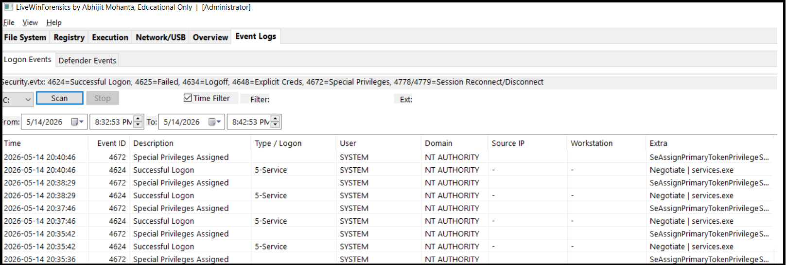
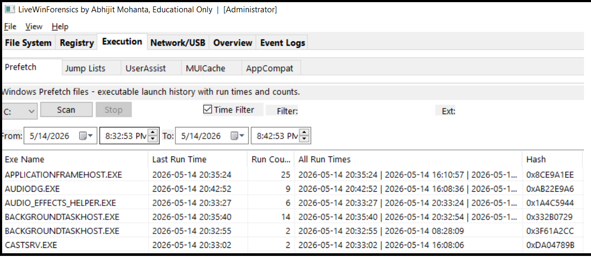
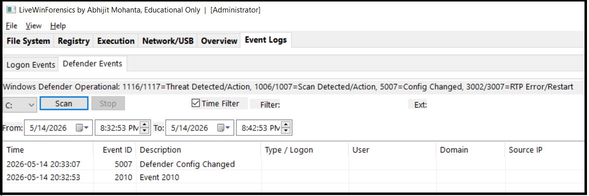
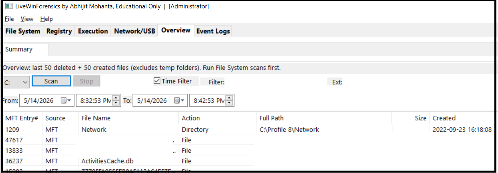

# LiveWinForensics

> **A unified live Windows forensics viewer for incident response and digital forensics.**  
> By Abhijit Mohanta — Educational Purpose Only

<!-- Replace the line below with your actual screenshot -->

---

## Overview

LiveWinForensics is a closed-source, standalone Win32 application that brings together six categories of live forensic artifacts into a single tabbed interface — no scripts, no dependencies, no external tools. Designed for incident responders, forensic analysts, and security researchers who need fast, on-system triage without installing a full forensic suite.

All timestamps are displayed in **local system time** (UTC → local conversion applied at every parser level).

---

## Screenshots

<!-- Add more screenshots below. Drag images into the GitHub editor or use the format: -->
<!--  -->

| File System — MFT | Registry — RunMRU | Event Logs — Logon Events |
|---|---|---|
|  |  |  |

| Execution — Prefetch | Defender Events | Overview |
|---|---|---|
|  |  |  |

---

## Features

### Six Main Tabs, 30+ Sub-tabs

#### File System
| Sub-tab | What it shows |
|---|---|
| MFT ($MFT) | Master File Table — file records with SI+FN timestamps, MFT entry number, deleted flag |
| USN Journal | NTFS change journal — file create/delete/rename events with action codes |
| $LogFile | NTFS transaction log — metadata operations |
| $Recycle.Bin | Deleted file records from all users' Recycle Bins |
| LNK Files | Shell shortcut files from Recent, Desktop, Taskbar — evidence of file access |

#### Registry
RecentDocs · UserAssist · RunMRU · TypedPaths · WordWheelQuery · FeatureUsage · OpenSaveMRU · MapNetDriveMRU · MountPoints2 · RecentApps · MUICache · AppCompatStore · Shellbags · OfficeRecentFiles · RDP MRU · LastVisitedMRU · SRUM App Usage · SRUM Network · SRUM Net Conn · SRUM Energy

#### Execution
| Sub-tab | What it shows |
|---|---|
| Prefetch | Win XP–Win11 .pf files — exe name, all run times, run count, hash, version |
| Jump Lists | AutomaticDestinations + CustomDestinations — recently opened files per app |
| UserAssist | ROT13-decoded program execution history with run count and last run time |
| MUICache | Executable display names — evidence of execution |
| AppCompat | AppCompatFlags — application compatibility execution artifacts |

#### Network / USB
RDP MRU · MountPoints2 · SRUM Network bytes sent/received · SRUM network connectivity duration

#### Event Logs (live, via Windows Event Log API)
| Sub-tab | Event IDs |
|---|---|
| Logon Events | 4624 Successful Logon · 4625 Failed Logon · 4634 Logoff · 4648 Explicit Credentials · 4672 Special Privileges · 4768/4769 Kerberos · 4776 NTLM · 4778/4779 Session Reconnect/Disconnect · 4800/4801 Lock/Unlock |
| Defender Events | 1116/1117 Threat Detected/Action · 1006/1007 Scan Events · 3002/3007 RTP Errors · 5000/5001 RTP Enabled/Disabled · 5007 Config Changed · 5013 Tamper Protection |

Logon Type column decodes numeric codes: `2-Interactive (Local)`, `3-Network (Remote)`, `10-RemoteInteractive (RDP)`, etc.

#### Overview
Last 50 deleted + 50 created files from MFT (temp folders excluded) — run File System scan first.

---

### Core Capabilities

- **MFT Entry# column** on all file system artifacts — cross-reference records by inode number
- **Independent per-tab scanning** — MFT, Registry, Prefetch can all scan simultaneously; switching tabs does not cancel other scans; Stop button affects only the current tab
- **Double-click cross-reference** on any file artifact — popup showing all related MFT entries, LNK shortcuts, and USN Journal events for that file
- **Time filter** — date/time range picker; all parsers respect local time
- **Keyword filter** — live search across all visible columns (400ms debounce)
- **Extension filter** — filter by file extension (e.g. `exe`, `docx`)
- **Export CSV** — current sub-tab or all loaded sub-tabs in one file
- **Quick / Full mode** toggle for MFT and USN (Quick = SI+FN timestamps; Full = all attributes)
- **Column sort** — click any column header to sort; click again to reverse
- **$LogFile** empty timestamps shown as N/A rather than blank

---

## Requirements

| Requirement | Details |
|---|---|
| OS | Windows 7 SP1 or later (x64 recommended) |
| Privileges | **Administrator required** for MFT, USN Journal, $LogFile raw volume access |
| Runtime | Visual C++ Redistributable 2019/2022 (x64) |
| Prefetch service | Must be enabled for Prefetch tab (default on most systems) |

Registry, LNK, Recycle.Bin, Jump Lists, Prefetch, and Event Logs work without admin rights (with reduced access on some protected logs).

---

## Usage

1. Run **LiveWinForensics.exe** as Administrator (UAC prompt appears automatically via manifest)
2. Select the drive letter from the dropdown (default: C:)
3. Click **Scan** on any sub-tab to load that artifact
4. Each tab scans independently — you can scan MFT and switch to Registry while MFT loads in background
5. Use **Filter**, **Ext**, and **Time Filter** controls to narrow results
6. Double-click any file artifact row to open the cross-reference popup
7. Click **Export CSV** to save current or all loaded tabs

---

## Parsed Artifacts Reference

### File System Columns
`MFT Entry#` · `Source` · `File Name` · `Action` · `Full Path` · `Size` · `Created` · `Modified` · `Accessed` · `MFT Modified` · `Extra`

### Registry Columns
`Artifact` · `Value Name` · `Value Data` · `Value Type` · `MRU Position` · `Last Write` · `First Interacted` · `Created On` · `Modified On` · `Accessed On` · `Last Interacted`

### Prefetch Columns
`Exe Name` · `Last Run Time` · `Run Count` · `All Run Times` · `Hash` · `Version` · `PF File` · `File Size`

### Jump List Columns
`Filename` · `Full Path` · `Record Time` · `Created` · `Modified` · `Accessed` · `App Name` · `App ID` · `MRU Position` · `Pinned` · `Type` · `Extension`

### Event Log Columns
`Time` · `Event ID` · `Description` · `Type/Logon` · `User` · `Domain` · `Source IP` · `Workstation` · `Extra` · `Computer` · `Record ID`

---

## Technical Notes

- **Prefetch decompression**: Win10/11 MAM (XPRESS-Huffman) compressed .pf files are decompressed via `RtlDecompressBufferEx` with `COMPRESSION_ENGINE_MAXIMUM`
- **Event log access**: Uses Windows Event Log API (`EvtQuery`, `EvtNext`, `EvtRender`) — reads live channels directly, falls back to .evtx file path
- **Registry timestamps**: All `RegQueryInfoKey` timestamps converted UTC → local before display
- **MFT parent resolution**: Full path reconstruction via inode parent map
- **Virtual list view**: All list views use `LVS_OWNERDATA` for performance with large datasets
- **Thread safety**: Per-tab scan threads with independent `std::atomic<bool>` cancel flags; mutex-protected data stores

---

## Version History

| Version | Changes |
|---|---|
| v7 | Event Logs tab: Logon Events (Security.evtx) + Defender Events (live EvtAPI) |
| v6 | Per-tab independent scanning; renamed LiveWinForensics; title bar author credit |
| v5 | Prefetch fix: correct MAM signature, COMPRESSION_ENGINE_MAXIMUM, CreateFileW I/O |
| v4 | MFT Entry# column; TCS_MULTILINE registry sub-tabs; double-click cross-reference; $LogFile N/A timestamps |
| v3 | UTC→local time fix across all parsers; Registry Path column removed; ASCII-only string literals |
| v2 | Time range filter; Extension filter; Quick/Full mode; Export CSV; Jump List AppID database |
| v1 | Initial release: MFT, USN, $LogFile, Recycle.Bin, LNK, Registry (20+ artifacts), Prefetch, Jump Lists |

---

## License

This is a **closed-source** application. Binary distribution only.  
For educational and research purposes. Not for use in unauthorized investigations.

---

## Author

**Abhijit Mohanta**  
Security Researcher | Malware Analyst | Author  

> *"Understanding attacker artifacts is the first step to faster incident response."*
